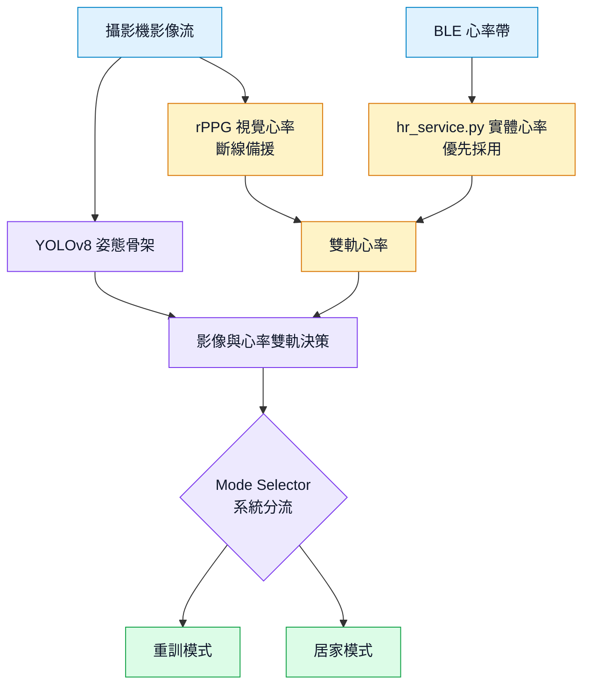
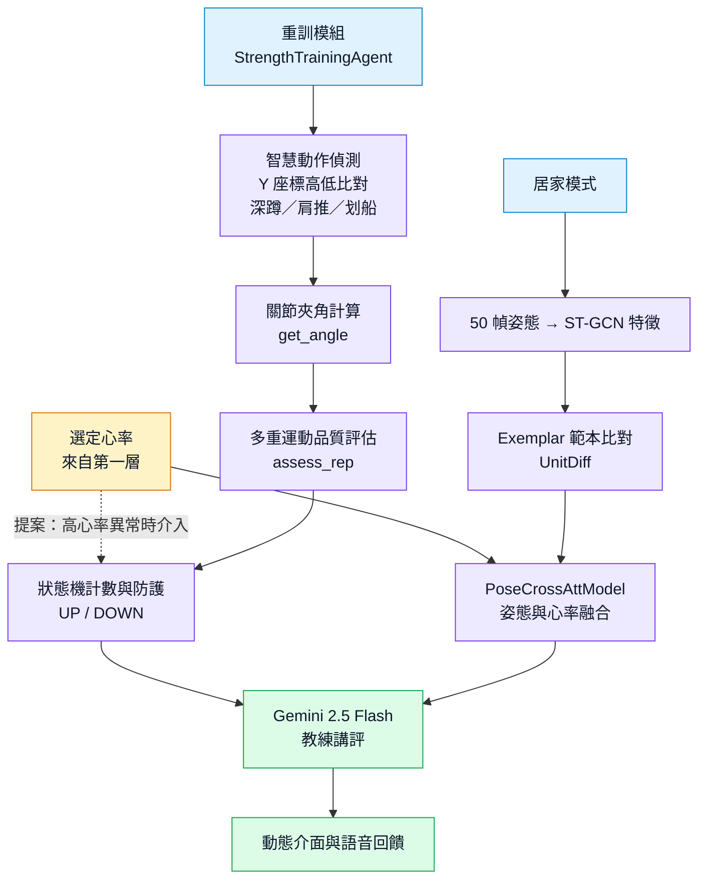

# 多模態 AI 健身教練 | Multimodal AI Fitness Coach

結合人體姿態估計、動作計次與雙軌心率感測的居家健身專題。系統提供重訓與居家運動模式，透過網頁即時顯示姿態、次數及回饋；另有只傳送骨架座標的端雲協同實驗路徑。

> 這是推甄展示用的程式與實驗流程。模型權重、受試者原始資料及舊版開發檔案未公開；完整執行需要自行備妥下列權重與硬體。

## 我的負責範圍

本專題為團隊合作；我主要負責以下部分：

- **第二層：資料分流與融合決策**。整合姿態與心率資訊，建立自動模式選擇與資料路由流程，讓系統依使用者狀態切換重訓或居家運動模式。
- **第三層：AI 核心評量與建議生成**。整合動作評分結果與生理資訊，提供即時訓練回饋及 AI 教練講評。
- **心率感測**。串接 BLE 心率帶與 rPPG 影像心率，處理心率來源切換、訊號品質判斷，並將可用的心率資料送入決策及評量流程。

## 系統重點

- **姿態與動作評估**：YOLOv8n-pose 擷取關節點，ST-GCN 與範本特徵用於動作品質分析；骨架訊號與遲滯狀態機負責計次，靜態動作改以持續時間呈現。
- **雙軌心率**：優先使用 BLE 心率帶，rPPG 影像心率作為備援，並以訊號品質決定是否顯示估計值。
- **自動模式選擇**：結合姿態及可用的心率資訊，切換重訓或居家模式。
- **即時互動**：FastAPI + WebSocket 傳送影像與回饋；設定 `GEMINI_API_KEY` 後可啟用生成式講評。
- **端雲協同研究**：`/ws_skeleton` 接收 17 個關節點與選填心率，供骨架卸載流程評分；`experiments/client_s2.py` 是參考客戶端。

## 架構

依照 AegisFit 提案簡報的四層設計，系統先取得姿態與雙軌心率，再決定訓練模式；重訓與居家模式各自評量動作，最後產生教練回饋。

### 第一、二層｜多模態感知與模式分流



### 第三、四層｜動作評估與生成式互動

提案中的重訓模式以硬體級中斷與疲勞防護為重點：偵測高心率異常時強制介入，引導離心放鬆。



圖中的強制介入與離心放鬆屬於提案設計；此公開版本在啟用 Gemini 時，會要求教練講評於高心率且動作低分時提醒安全，尚未實作硬體中斷控制。

`/ws` 是網頁運行路徑；`/ws_skeleton` 的骨架卸載屬於另外的端雲協同實驗，詳見 [實驗說明](experiments/README.md)。

## 專案目錄

| 路徑 | 用途 |
| --- | --- |
| `app.py`, `index.html` | 網頁與 WebSocket 服務 |
| `AI_Agent_*.py`, `Mode_Selector.py` | 模式選擇、姿態評分與互動 |
| `hr_service.py`, `rPPG_service.py`, `rppg_algorithms.py` | BLE 與影像心率 |
| `rep_counter.py` | 骨架動作計次 |
| `models/` | 模型結構與特徵處理程式 |
| `experiments/` | 合成驗證、資料收集與傳輸實驗；詳見 [實驗說明](experiments/README.md) |

## 執行方式

已驗證的開發環境為 **Python 3.11 / Windows 11**。從儲存庫根目錄執行：

```powershell
py -3.11 -m venv .venv
.\.venv\Scripts\Activate.ps1
python -m pip install -r requirements.txt
```

請把自行取得或訓練的模型檔案放在程式預期的位置：

| 路徑 | 用途 |
| --- | --- |
| `yolov8n-pose.pt` | 姿態估計 |
| `best_model 1.pth` | 融合模型 |
| `models/gcn_weight.pth` | ST-GCN 特徵提取 |
| `models/resnet_weight.pth` | EMG 特徵提取 |
| `exemplar_bank.pt` | 動作參考範本 |

程式會在缺少必要權重時無法啟動對應模式。本儲存庫沒有提供模型下載連結，因為相關權重的來源與再散布條件尚需逐一確認。

使用 BLE 心率帶時，可在 PowerShell 設定裝置位址；留空則由程式掃描心率裝置。生成式講評是選用功能，未設定金鑰時其餘功能仍可使用。

```powershell
$env:BLE_HR_ADDRESS = "你的心率帶位址"
$env:GEMINI_API_KEY = "你的金鑰"
python -m uvicorn app:app --host 127.0.0.1 --port 8000
```

接著開啟 <http://127.0.0.1:8000>，並允許瀏覽器使用攝影機。環境變數範例見 [`.env.example`](.env.example)；程式不會自動載入 `.env` 檔。

## 驗證與實驗

以下命令可在沒有真人資料的情況下驗證演算法與計次邏輯：

```powershell
python experiments/test_rppg_synth.py
python experiments/test_rep_counter.py
python experiments/test_rppg_service.py
```

傳輸實驗的既有紀錄採用 **640×480 合成畫面**。在該條件下，S1 全影像方案約 **31,669 B/影格**，S2 JSON 骨架方案約 **422 B/影格**，約減少 **75 倍**。另一本機 WebSocket 回聲測試只量傳輸、不含模型運算，量得上行 payload 約 **11,652 B** 與 **298 B**。這些數字是測試條件下的結果，不能視為真人運動、手機端推論或廣域網路的實測效能。重現方式與限制見 [實驗說明](experiments/README.md)。

## 公開範圍與限制

- 本儲存庫不包含模型權重、真實受試者生理資料與原始影像。`experiments/results/` 已排除在 Git 之外。
- rPPG 受光線、臉部可見度與動作干擾影響；品質不足時應顯示無可信讀數。
- `experiments/` 內包含研究腳本與合成驗證，不能把合成數據解讀成臨床或真人運動評估。
- 本專題為學術展示，尚未經醫療用途驗證。
